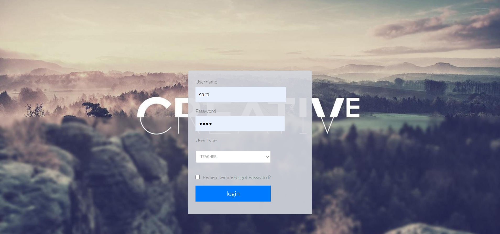
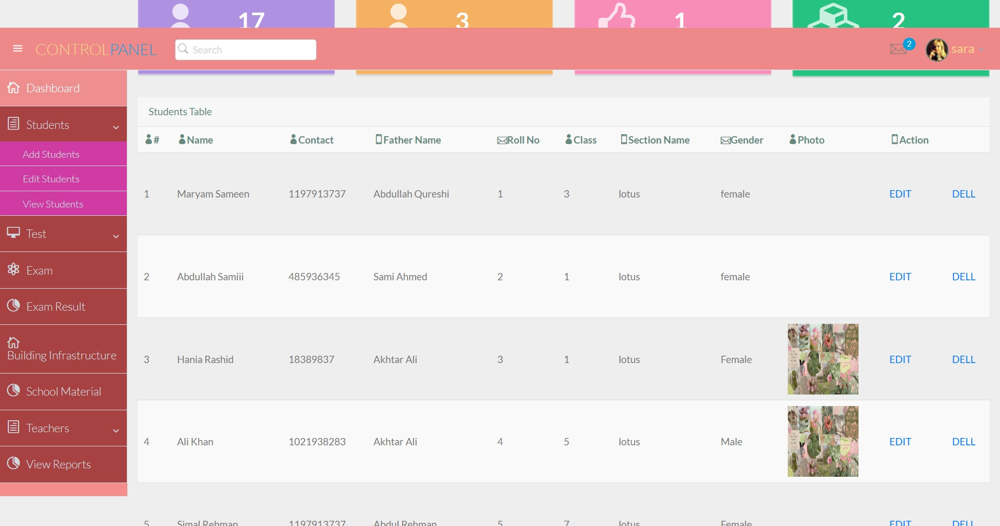
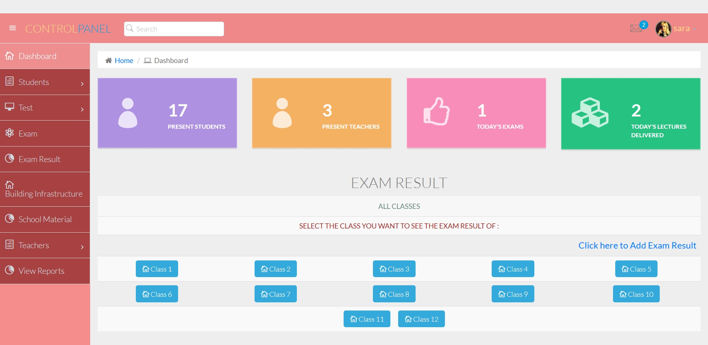
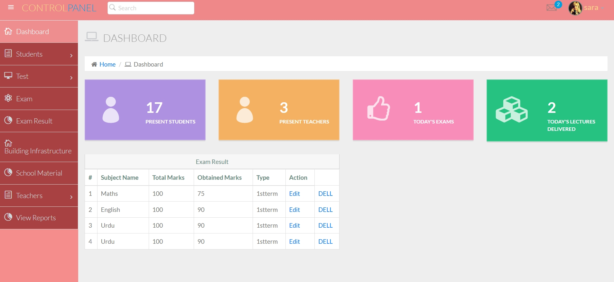
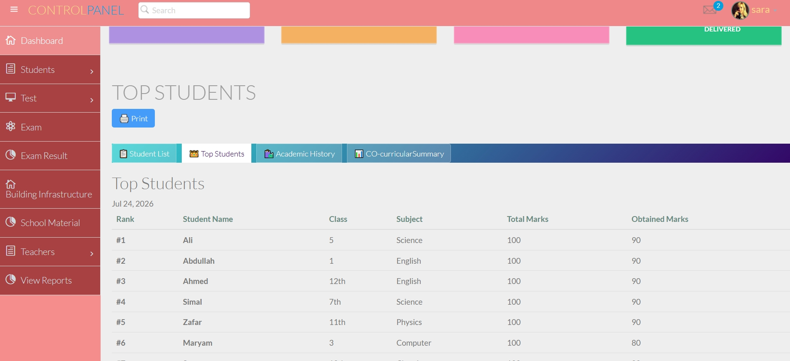
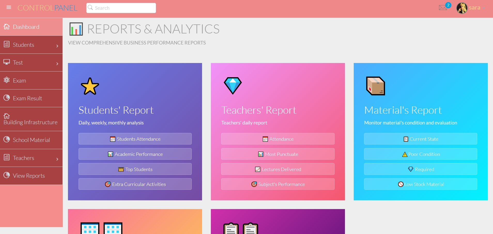
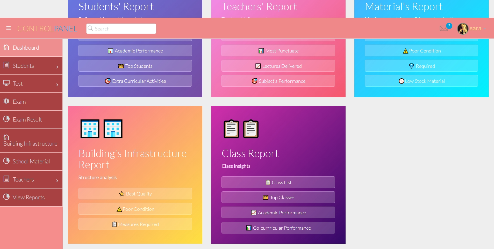

# 🏫 School Management System

A full-stack **School Management System** built with PHP and MySQL for managing students, teachers, classes, examinations, results, reports, and role-based access.

## 📌 Project Overview

This project is a database-driven web application developed using **PHP, MySQL, PDO, HTML5, CSS3, JavaScript, and Bootstrap**.

The system provides a centralized platform for managing common school operations and organizing academic information.

The application uses a relational MySQL database containing **21 tables** designed to support its different modules.

---

## ⭐ Key Highlights

* 👨‍🎓 Student management
* 👨‍🏫 Teacher management
* 🏫 Class management
* 📝 Examination management
* 📊 Result management
* 📄 Report card generation
* 📅 Daily reports
* 🔐 Authentication and password verification
* 👥 Role-based permissions
* 🔎 Search and record management
* 🖥️ Admin panel
* 📱 Responsive interface
* 🗄️ 21-table relational MySQL database
* 🔗 PDO-based database interaction

---

## 👨‍💻 My Contribution

I designed and developed this School Management System as a full-stack web development project.

My work included:

* Designing the **21-table MySQL database structure**
* Developing the PHP backend
* Implementing CRUD operations
* Implementing database operations using PDO
* Developing authentication and password verification
* Implementing role-based permissions
* Developing student management functionality
* Developing teacher and class management functionality
* Developing examination and result management
* Developing report-card functionality
* Developing daily reporting
* Building the admin panel
* Implementing search and record management
* Connecting application modules with the database
* Building the application from scratch

---

## 🚀 Main Features

### 👨‍🎓 Student Management

* Manage student records
* Search student information
* Maintain student and academic records

### 👨‍🏫 Teacher Management

* Manage teacher records
* Store and organize teacher information

### 🏫 Class Management

* Manage classes
* Organize student and class-related records

### 📝 Examination & Results

* Examination management
* Result management
* Student result records
* Report card generation

### 📊 Reporting

The system includes reporting functionality for organizing and viewing student and academic information.

### 🔐 Authentication & Permissions

The system includes:

* User authentication
* Password verification
* Role-based permissions
* Controlled access to different parts of the application

---

## 🛠️ Technologies Used

| Technology     | Purpose                              |
| -------------- | ------------------------------------ |
| **PHP**        | Backend development                  |
| **MySQL**      | Database management                  |
| **PDO**        | Database interaction                 |
| **HTML5**      | Page structure                       |
| **CSS3**       | Styling                              |
| **JavaScript** | Client-side functionality            |
| **Bootstrap**  | User interface and responsive design |
| **XAMPP**      | Local development environment        |

---

## 🗄️ Database

The project uses a MySQL database named:

```text
cms
```

The database structure is included in:

```text
cms.sql
```

The database contains **21 tables** designed to support the different modules of the School Management System.

---

## 📸 Screenshots

Screenshots of the application are included in the [`Screenshots`](Screenshots/) directory.

### 🏠 Homepage


### 🔐 Login Page



### 👨‍🎓 Student Management



### 🏫 Class Management



### 📝 Examination Results



### 📊 Student Reports



### 📈 Reports





---

## 💻 Installation & Setup

### 1. Install XAMPP

Install XAMPP with **Apache** and **MySQL**.

### 2. Clone or Download the Repository

Place the project inside the XAMPP `htdocs` directory.

Example:

```text
C:\xampp\htdocs\CMS
```

### 3. Start XAMPP

Start:

* Apache
* MySQL

### 4. Create the Database

Open phpMyAdmin:

```text
http://localhost/phpmyadmin
```

Create a database named:

```text
cms
```

### 5. Import the Database

Import the provided:

```text
cms.sql
```

file into the `cms` database.

### 6. Check the Database Connection

The project is configured for a local XAMPP MySQL environment.

The current local configuration uses:

```text
Host: localhost
Username: root
Password: empty
Database: cms
```

If your local MySQL configuration is different, update the database connection settings accordingly.

### 7. Open the Project

Open:

```text
http://localhost/CMS
```

---

## 📂 Repository Structure

The repository includes:

```text
CMS/
├── admin-panel/
├── adward-master/
├── Screenshots/
├── cms.sql
├── connect.php
├── session.php
├── header.php
├── index.php
└── .gitignore
```

The project also contains additional PHP, CSS, JavaScript, image, and asset files used throughout the application.

---

## 🔐 Demo Data & Privacy

All data included in this repository is **fictional/demo data** created for development and demonstration purposes.

Student names, teacher names, contact information, phone numbers, photographs, and other personal information are not real.

No real user information is intended to be included in this project.

---

## 🎯 Skills Demonstrated

This project demonstrates practical experience with:

* PHP development
* MySQL database design
* PDO
* CRUD operations
* Authentication
* Authorization
* Role-based access control
* Backend development
* Relational database design
* Database-driven web applications
* Building a complete web application from scratch

---

## ⚠️ Current Status

This project is currently configured for **local development using XAMPP**.

It has not yet been configured as a live hosted application.

For deployment to a live hosting server, database connection settings and server configuration would need to be updated according to the hosting environment.

---

## 🔮 Future Improvements

Possible future improvements include:

* Live hosting deployment
* Additional user roles and permissions
* Further UI improvements
* Additional reporting features
* Production-specific configuration
* Further security hardening

---

## 📄 License

No open-source license has been applied to this repository.


